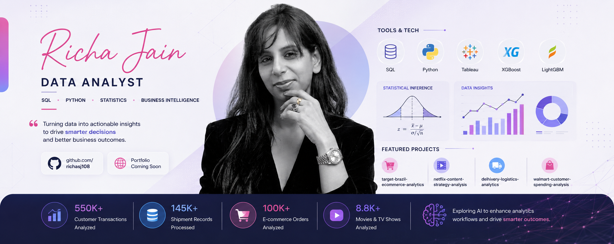

  

 
# Hi there, I'm Richa Jain 👋

## Data Analyst | SQL • Python • Business Intelligence • Statistics

I enjoy solving business problems using data.

Using SQL, Python, Statistics, and Business Intelligence, I help organizations uncover actionable insights, make data-driven decisions, and improve business outcomes.

My work focuses on customer analytics, product analytics, logistics optimization, statistical inference, and data storytelling.

Currently exploring how AI can enhance analytics workflows while continuing to deepen my expertise in Business Intelligence and Data Analytics.

---

## 🛠 Tech Stack

**Technologies**

SQL • Python • Pandas • NumPy • Tableau • Excel • Google BigQuery

**Data Analytics**

EDA • Data Cleaning • Data Visualization • Feature Engineering • Business Analytics • Product Analytics • KPI Analysis

**Statistics**

Probability • Hypothesis Testing • Confidence Intervals • ANOVA • t-Test • Chi-Square Test

---

## 📌 Featured Projects

### 🛒 [Target Brazil E-Commerce Analytics](https://github.com/Richa-Jain108/target-brazil-ecommerce-analytics)

Analyzed **100,000+ e-commerce orders** using **Advanced SQL** and **Google BigQuery** to uncover customer purchasing behavior, payment trends, delivery performance, and regional sales patterns, delivering actionable insights to improve business operations and customer experience.

### 🎬 [Netflix Content Strategy Analysis](https://github.com/Richa-Jain108/netflix-content-strategy-analysis)

Explored **8,807 movies and TV shows** through exploratory data analysis to identify content trends across genres, countries, release years, and content types, delivering strategic recommendations for content investment.

### 🚚 [Delhivery Logistics Feature Engineering & Operations Analytics](https://github.com/Richa-Jain108/delhivery-logistics-feature-engineering-analysis)

Processed **145,000+ shipment records** to engineer predictive features, evaluate logistics performance, identify operational inefficiencies, and recommend opportunities to improve supply chain efficiency.

### 🛍 [Walmart Customer Spending Analysis](https://github.com/Richa-Jain108/walmart-customer-spending-analysis-clt)

Applied descriptive statistics and hypothesis testing to **550,000+ customer transactions**, uncovering Black Friday purchasing patterns and supporting data-driven business decisions through confidence intervals and statistical inference.

---

## 📚 Additional Analytics Projects

### 🚴 [Yulu Bike Demand Analysis](https://github.com/Richa-Jain108/yulu-bike-demand-analysis-hypothesis-testing)

Demand analysis using hypothesis testing, ANOVA, Chi-Square testing, and business recommendations.

### 🏃 [Aerofit Customer Profiling Analysis](https://github.com/Richa-Jain108/aerofit-customer-profiling-analysis)

Customer segmentation and probability analysis to identify target customer profiles and improve product recommendations.

---

## 🌱 Currently Learning

* Pursuing Data Science & Machine Learning through Scaler Academy

---

## 🚀 Side Projects (Published on Google Play)

Built and published Android applications on Google Play using AI-assisted development workflows and rapid prototyping, taking ideas from concept to production.

### 📱 [Quiz Master](https://play.google.com/store/apps/details?id=com.rjenterprises.crorepatiquizmaster)

An Android quiz application featuring **real Kaun Banega Crorepati (KBC)** questions, allowing users to test their knowledge through an interactive game-show style experience.

### 📈 [Stock Sage](https://play.google.com/store/apps/details?id=com.rjenterprises.stocksage)

AI-powered Stock Averaging & Investment Calculator.

---

## 🤝 Let's Connect

💼 LinkedIn: https://linkedin.com/in/YOUR-LINK

🌐 Portfolio: Coming Soon

📄 Resume: Add Resume Link

📧 Email: **[richasj108@gmail.com](mailto:richasj108@gmail.com)**

---

⭐ Passionate about transforming messy datasets into meaningful business insights and currently seeking **Data Analyst opportunities** where I can help organizations make smarter, data-driven decisions.

---

⭐ I enjoy transforming messy datasets into meaningful business insights and am currently seeking ** Data Analyst opportunities** where I can help organizations make smarter, data-driven decisions.
